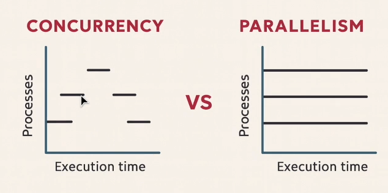

### Concurrency 
- Doing multiple tasks at once ; multitasking 
- Two concepts: 1. threading.Thread and 2. asyncio
- Using Only 1 core but each function running in different threads

### Parrallelism 
- Running Multiple tasks at the exact same time
- Two concepts: 1. multiprocessing.Process and 2. concurrent.futures.ProcessPoolExecutor

